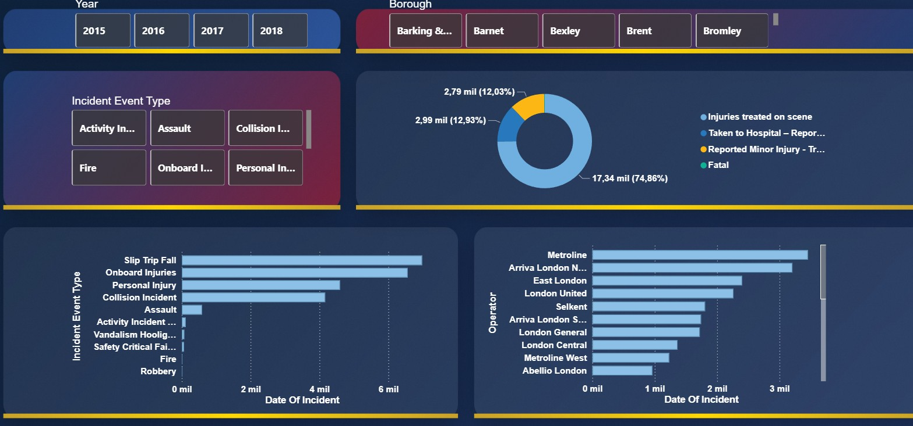
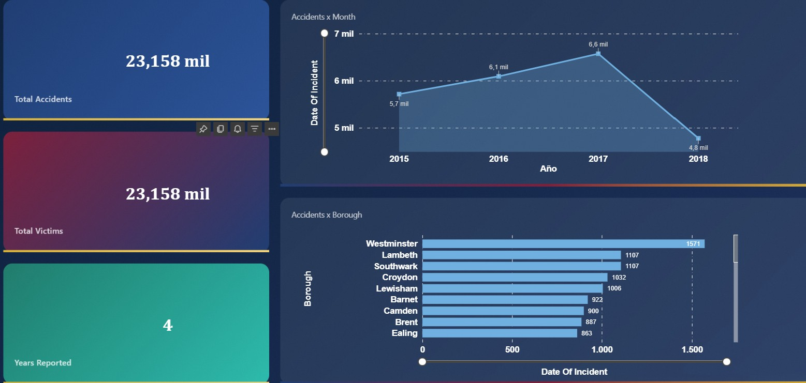
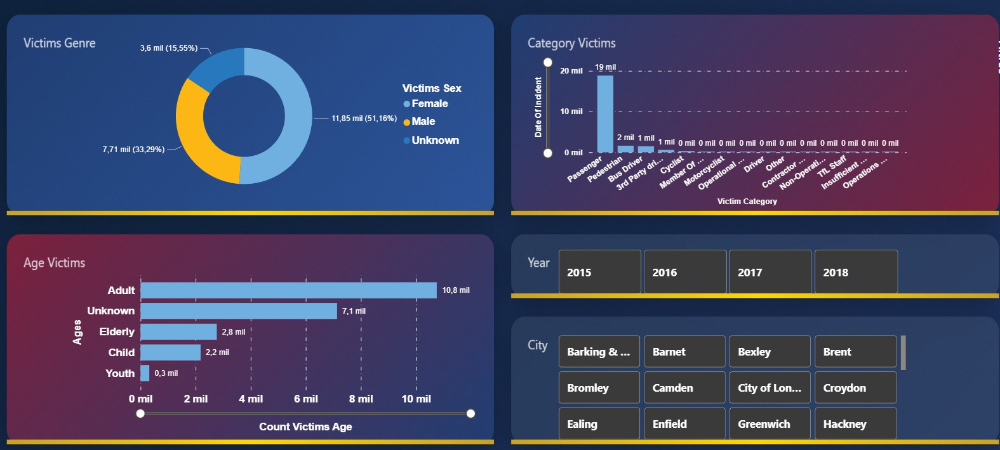

<h1 align="center">🚦 London Transport Incident Dashboard</h1>
<p align="center"><b>Turning transport incident data into prevention insights (2015–2018)</b></p>

<p align="center">
  
  
  
  
</p>

<p align="center">
  
</p>

---

## ✨ Why this project matters

Every incident in public transport is more than a number: it affects people, operations, and city safety.  
This project was built to answer one key question:

> **Where, when, and how are incidents happening, so prevention can be prioritized with evidence?**

Using Power BI, the analysis turns raw records into clear decision-making views for borough-level risk, incident types, victim profiles, and operator patterns.

---

## 🧠 What was done

- Cleaned and standardized transport incident records.
- Prepared an analysis-ready model in Power BI.
- Built interactive pages for:
  - Time trends
  - Borough risk concentration
  - Incident event types
  - Victim demographics
  - Injury outcomes
- Documented dataset logic in:
  - `documentation/data_dictionary.md`

---

## 🖼️ Dashboard snapshots

<table>
  <tr>
    <td align="center"><b>Overview</b></td>
    <td align="center"><b>Main Report</b></td>
  </tr>
  <tr>
    <td></td>
    <td></td>
  </tr>
  <tr>
    <td align="center"><b>Victim Profile</b></td>
    <td align="center"><b> Space for new visuals</b></td>
  </tr>
  <tr>
    <td></td>
  </tr>
</table>


---

## 🔍 Key analytical questions answered

- Which boroughs concentrate the highest incident volume?
- How do incidents evolve over time?
- Which incident event types are most frequent?
- Which victim groups are most affected by sex and age?
- How do injury outcomes vary by context and operator?

---

## 🗂️ Repository structure

````text
power_bi_transport_incident_dashboard/
│   README.md
│
├───Assets
│       overview.jpg
│       report.jpg
│       victims_profile.jpg
│
├───dashboard
│       Accidents_Project.pbix
│
├───dataset
│       london_transport_data.xlsx
│
└───documentation
        data_dictionary.md
